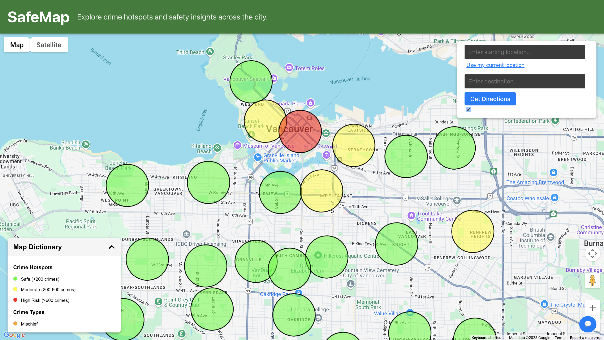

# 🗺️ SafeMap

An interactive web application designed to help users navigate cities more safely by avoiding high-crime hotspots.
Built with **React.js**, **Node.js**, **Google Maps API**, and powered by **Google Gemini AI** for intelligent assistance.



---

## Inspiration

When navigating unfamiliar areas whether traveling, commuting, or jogging at night, we realized most maps only focus on getting you somewhere fast, not safely.  
We wanted a tool that actively helps users avoid high-crime zones, offering safer routes rather than just the shortest paths.  
**SafeMap** was built with a simple goal: help people move smarter, safer, and with more confidence.

---

## Features

-   📍 **Crime Visualization:**
    Explore Vancouver's crime data (2010–2025) as live markers and hotspot clusters.
-   🛣️ **Safer Navigation:**
    Get routes that prioritize safety by avoiding areas with high crime concentrations.
-   🔥 **Hotspot Detection:**
    Switch between viewing individual crime markers and neighborhood hotspots.
-   🤖 **AI Chatbot (Gemini):**
    Ask about safest routes, area crime summaries, or general safety questions.
-   🛑 **Risk Warnings:**
    Alerts if no fully safe route is available.

---

## How We Built It

-   **Frontend:**
    React.js + Vite for a fast and responsive single-page application.
-   **Backend:**
    Node.js + Express server handling crime data API and Gemini integration.
-   **Mapping and Routing:**
    Google Maps API for directions, markers, circles, and path analysis.
-   **Generative AI:**
    Google Gemini API used for smart, conversational safety assistance.

---

## Tech Stack

-   React.js
-   Node.js + Express
-   Vite
-   Google Maps JavaScript API
-   Google Gemini API
-   SCSS

---

## 🔮 Future Improvements

-   Real-time community reports ("Unsafe here", "Incident just occurred", etc.).
-   Allow Gemini to directly generate and display safe routes upon chat request.
-   Support for multiple cities worldwide.

---

## ⚙️ How to Run Locally

1.  **Clone the repository:**
    ```bash
    git clone https://github.com/yourusername/safe-map.git
    cd safe-map
    ```

2.  **Install dependencies for both frontend and backend:**
    *(Installs frontend dependencies)*
    ```bash
    npm install
    ```
    *(Install backend dependencies)*
    ```bash
    cd backend
    npm install
    cd ..
    ```

3.  **Set up your environment variables:**
    Create a `.env` file at the **root** of the project (`safe-map/`) and add your API keys:
    ```env
    VITE_GOOGLE_MAPS_API_KEY=your_google_maps_key
    GEMINI_API_KEY=your_gemini_api_key
    ```
    *(Note: The backend might also need access to the Gemini key depending on your setup. If so, create a `.env` file inside the `backend` directory as well or configure it to read from the root `.env`)*

4.  **Start the backend server:**
    ```bash
    cd backend
    npm start
    ```
    *(The backend server will typically run on a port like 3000 or 5000)*

5.  **Start the frontend development server (in a separate terminal):**
    *(Make sure you are in the root `safe-map` directory)*
    ```bash
    npm run dev
    ```
    *(The frontend will usually open in your browser, often on port 5173 for Vite)*
